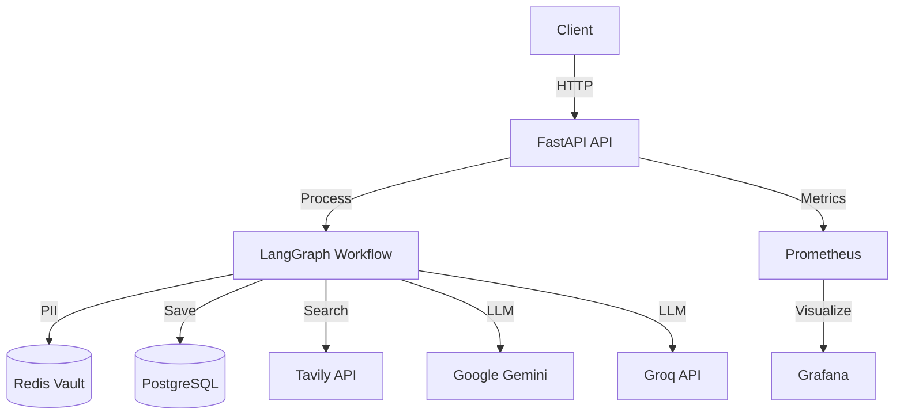

# 🦫 Beaver Agent - Production-Ready Autonomous Email Processing System

[](https://github.com/yourusername/beaver-agent/actions)
[](LICENSE)
[](https://www.python.org/downloads/)

An enterprise-grade AI-powered email processing system that intelligently routes, processes, and responds to incoming emails using LangGraph workflows with comprehensive PII protection and quality verification.

## ✨ Features

- **🤖 Multi-Agent Workflow**: Intelligent email routing with specialized agents (router, researcher, writer, verifier, support)
- **🔒 Enterprise Security**: Redis-based PII vault with encryption, TTL, and audit logging
- **📊 Production Monitoring**: Prometheus metrics, Grafana dashboards, structured JSON logging
- **⚡ High Performance**: Async FastAPI, rate limiting, connection pooling
- **🧪 Comprehensive Testing**: Unit, integration, and API tests with 80%+ coverage
- **🐳 Container-Ready**: Multi-stage Docker builds, docker-compose orchestration
- **🔄 CI/CD Pipeline**: Automated testing, linting, security scanning, deployment
- **📈 Scalable Architecture**: Horizontal scaling, load balancing ready
- **🧠 Hybrid Intelligence**: Cost-optimized tiered classification (Zero-Shot + LLM Fallback)

## 💡 End-to-End Use Case

### Scenario: The Solar Panel Inquiry

**1. Input**
User receives an email:
> "Hi, I'm John Smith (555-0199). I want to install solar panels for my 5000 sq ft warehouse in Austin, TX. Can you give me a quote? - CEO, GreenTech Logistics"

**2. 🕵️ PII Redaction (Privacy First)**
Before processing, the **Security Node** intercepts and redacts sensitive data using the Redis Vault:
> "Hi, I'm [PERSON_1] ([PHONE_1]). I want to install solar panels for my 5000 sq ft warehouse in [LOCATION_1]. Can you give me a quote? - CEO, GreenTech Logistics"

**3. 🧠 Hybrid Classification (Cost-Optimized)**
The **Router Node** analyzes intent:
- **Tier 1**: Checks with Zero-Shot Classifier. (Result: "Sales Lead" with **92% Confidence**)
- **Action**: High confidence detected -> Skips expensive LLM call. Routes to **Lead Pipeline**.

**4. 🌍 Company Research**
The **Researcher Node** extracts "GreenTech Logistics" and scans the web:
- *Found*: "GreenTech Logistics is a transport company based in Austin, focusing on sustainable supply chains."
- *Insight*: They value sustainability -> Draft should emphasize "eco-friendly" benefits.

**5. ✍️ Intelligent Drafting**
The **Writer Node** generates a personalized response:
- Uses extracted template
- Injects research insights
- Restores PII placeholders (replaces `[PERSON_1]` back with "John Smith")

**6. ✅ Verification & Output**
The **Verifier Node** checks for quality and safety.
**Final Output**:
> "Dear John Smith,
>
> Thank you for reaching out! We'd love to help power GreenTech Logistics's warehouse with sustainable energy. Given your focus on sustainable supply chains, our high-efficiency commercial panels would be a perfect fit..."

---

## 🏗️ Architecture



## 🚀 Quick Start

### Prerequisites

- Python 3.11+
- Docker & Docker Compose (optional)
- Redis (for PII vault)
- API Keys: Google Gemini or Groq, Tavily

### Local Development

```bash
# Clone repository
git clone https://github.com/yourusername/beaver-agent.git
cd beaver-agent

# Create virtual environment
python -m venv .venv
source .venv/bin/activate  # On Windows: .venv\Scripts\activate

# Install dependencies
pip install -r requirements.txt

# Configure environment
cp .env.example .env
# Edit .env with your API keys

# Run Redis (required for PII vault)
docker run -d -p 6379:6379 redis:7-alpine

# Run API
uvicorn src.api:app --reload

# Run UI (separate terminal)
streamlit run src/ui.py
```

Access the application:
- **API**: http://localhost:8000
- **API Docs**: http://localhost:8000/docs
- **UI**: http://localhost:8501
- **Health**: http://localhost:8000/health
- **Metrics**: http://localhost:8000/metrics

### Docker Deployment

```bash
# Configure environment
cp .env.example .env
# Edit .env with your API keys

# Start all services
docker-compose up -d

# View logs
docker-compose logs -f api

# Stop services
docker-compose down
```

Access services:
- **API**: http://localhost:8000
- **UI**: http://localhost:8501
- **Prometheus**: http://localhost:9090
- **Grafana**: http://localhost:3000 (admin/admin)

## 📖 Configuration

All configuration is managed through environment variables. See [.env.example](.env.example) for all options.

### Key Configuration Options

| Variable | Description | Default |
|----------|-------------|---------|
| `MODEL_PROVIDER` | LLM provider (gemini/groq) | `gemini` |
| `ENVIRONMENT` | Environment (development/staging/production) | `development` |
| `LOG_LEVEL` | Logging level | `INFO` |
| `REDIS_URL` | Redis connection URL | `redis://localhost:6379/0` |
| `RATE_LIMIT_REQUESTS` | Requests per minute | `10` |
| `PII_VAULT_TTL` | PII vault TTL in seconds | `3600` |

## 🔐 Security

### PII Protection

- **Detection**: 7 entity types (phone, email, person, credit card, location, date, IBAN)
- **Encryption**: Fernet symmetric encryption for PII data
- **Storage**: Redis with automatic TTL expiration
- **Confidence Threshold**: Configurable (default 60%)

### API Security

- **Authentication**: API key-based authentication
- **Rate Limiting**: Configurable per-IP rate limits
- **Input Validation**: Pydantic models with strict validation
- **CORS**: Configurable CORS policies

## 🧪 Testing

```bash
# Run all tests
pytest tests/ -v

# Run with coverage
pytest tests/ --cov=src --cov-report=html

# Run specific test suite
pytest tests/test_agents.py -v

# Run security tests
pytest tests/test_security.py -v
```

## 📊 Monitoring

### Prometheus Metrics

- `emails_processed_total`: Total emails processed by category
- `email_processing_duration_seconds`: Processing time histogram
- `pii_entities_detected_total`: PII entities detected by type
- `http_requests_total`: HTTP requests by endpoint and status
- `active_requests`: Current active requests

### Grafana Dashboards

Import the provided Grafana dashboard JSON for pre-configured visualizations.

## 🔄 CI/CD

The project includes a GitHub Actions pipeline that:

1. **Test**: Runs pytest with coverage reporting
2. **Lint**: Checks code style with flake8 and black
3. **Type Check**: Validates types with mypy
4. **Security**: Scans with Bandit and Safety
5. **Build**: Creates Docker image
6. **Deploy**: Deploys to production (configure as needed)

## 📚 API Documentation

### Process Email

```bash
POST /process-email
Content-Type: application/json
X-API-Key: your-api-key

{
  "email_text": "Hi, I want to buy your product..."
}
```

Response:
```json
{
  "category": "lead",
  "company": "Acme Corp",
  "draft": "Dear Acme Corp,\n\nThank you for your interest...",
  "trace_id": "abc-123-def",
  "processing_time_ms": 1234
}
```

### Health Check

```bash
GET /health
```

### Metrics

```bash
GET /metrics
```

## 🛠️ Development

### Project Structure

```
beaver-agent/
├── src/
│   ├── agents.py          # Agent node implementations
│   ├── api.py             # FastAPI application
│   ├── config.py          # Configuration management
│   ├── db.py              # Database operations
│   ├── graph.py           # LangGraph workflow
│   ├── logger.py          # Structured logging
│   ├── metrics.py         # Prometheus metrics
│   ├── security.py        # PII detection & vault
│   ├── state.py           # State definitions
│   └── ui.py              # Streamlit interface
├── tests/
│   ├── conftest.py        # Pytest fixtures
│   ├── test_agents.py     # Agent tests
│   ├── test_api.py        # API tests
│   └── test_security.py   # Security tests
├── .github/
│   └── workflows/
│       └── ci.yml         # CI/CD pipeline
├── docker-compose.yml     # Service orchestration
├── Dockerfile             # Container definition
├── requirements.txt       # Python dependencies
└── README.md              # This file
```

### Adding New Features

1. Create feature branch: `git checkout -b feature/your-feature`
2. Implement changes with tests
3. Run tests: `pytest tests/ -v`
4. Commit and push
5. Create pull request

## 📈 Performance

- **Throughput**: 100+ emails/minute (single instance)
- **Latency**: <2s average processing time
- **Concurrency**: Async processing with connection pooling
- **Scalability**: Horizontal scaling with load balancer

## 🐛 Troubleshooting

### Redis Connection Failed

```bash
# Check Redis is running
docker ps | grep redis

# Start Redis
docker run -d -p 6379:6379 redis:7-alpine
```

### API Key Errors

Ensure your `.env` file contains valid API keys:
```bash
GOOGLE_API_KEY=your_key_here
TAVILY_API_KEY=your_key_here
```

### Import Errors

```bash
# Reinstall dependencies
pip install -r requirements.txt --force-reinstall
```

## 📄 License

This project is licensed under the MIT License - see the [LICENSE](LICENSE) file for details.

## 🤝 Contributing

Contributions are welcome! Please read our [Contributing Guide](CONTRIBUTING.md) for details on our code of conduct and the process for submitting pull requests.

## 📞 Support

- **Issues**: [GitHub Issues](https://github.com/yourusername/beaver-agent/issues)
- **Documentation**: [Full Documentation](https://docs.yourproject.com)
- **Email**: support@yourproject.com

## 🙏 Acknowledgments

- [LangGraph](https://github.com/langchain-ai/langgraph) for workflow orchestration
- [Microsoft Presidio](https://github.com/microsoft/presidio) for PII detection
- [FastAPI](https://fastapi.tiangolo.com/) for the API framework
- [Streamlit](https://streamlit.io/) for the UI framework

---

**Built with ❤️ for enterprise email automation**
